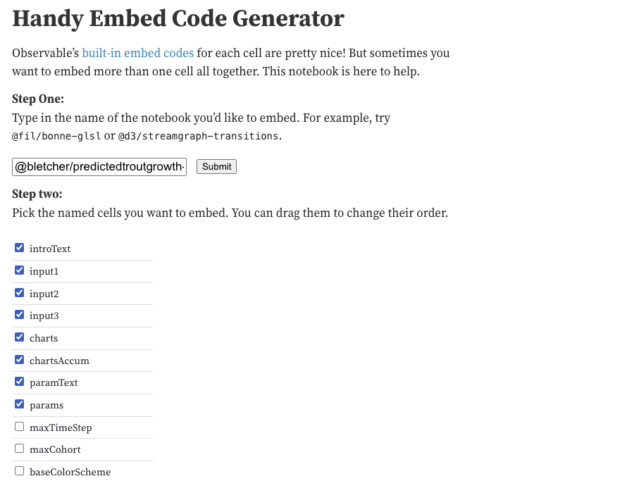

# EcoSHEDS Homepage

## Project Setup

### Dependencies

Install node.js dependencies

```sh
npm install
```

### Configuration

Configure the application using `.env` files per vue cli [Configuration Reference](https://cli.vuejs.org/config/). All variables should be defined using local files (e.g. `.env.*.local` ), which are not tracked by git.

See `.env` for list of required variables.

## Development

Start development server, then navigate to http://localhost:8080

```sh
npm run serve
```

### Observable Embeds

To embed observable notebooks, use the [Handy Embed Code Generator](https://observablehq.com/@jashkenas/handy-embed-code-generator).

Enter the notebook name (`@username/notebook`), then select the desired cells to include. Primarily, only the text, input, and output cells need to be selected. However, sometimes additional data cells are needed. Note that each cell needs to be named in the notebook (including markdown cells).




Copy the html code into a vue component (e.g., `src/views/WestbrookTrout/Predictions.vue`), and the JavaScript into a separate js file (e.g., `public/js/westbrook-trout/predictions.js`). Note the js file should be in the `public/` directory so that it is not modified by the build process.

Create a new script element within the component to load the js file during the `created()` hook:

```js
export default {
  created () {
    const script = document.createElement('script')
    script.async = true
    script.type = 'module'
    script.src = 'js/westbrook-trout/predictions.js'
    document.head.appendChild(script)
  }
}
```

Finally, add the `observable.css` into the component.

```html
<link rel="stylesheet" href="css/observable.css">
```

Use a `.hidden` class to hide code/data blocks.

```css
.hidden {
  visibility: hidden;
  height: 0;
}
```

## Production

## Staging Build

Build for staging

```sh
npm run stage
```

## Production Build

Build for production

```
npm run build
```

## Deploy

Copy contents of `dist/` to remote server or s3 bucket.

```sh
aws s3 sync dist/ s3://<STORAGE_BUCKET>/apps/ecosheds --delete
```
